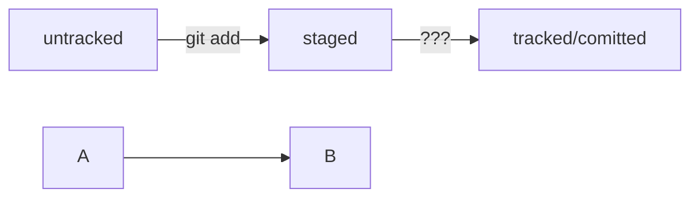

# Test1
## gfg
just test repository to start

```mermaid
graph LR;
  untracked -- "git add" --> staged;
  staged    -- "???"     --> tracked/comitted;

%% стрелка без текста для примера: 
  A --> B;
``` 
